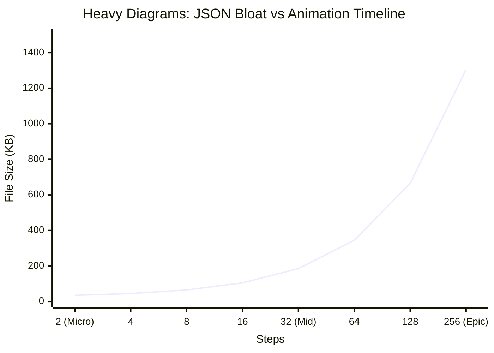
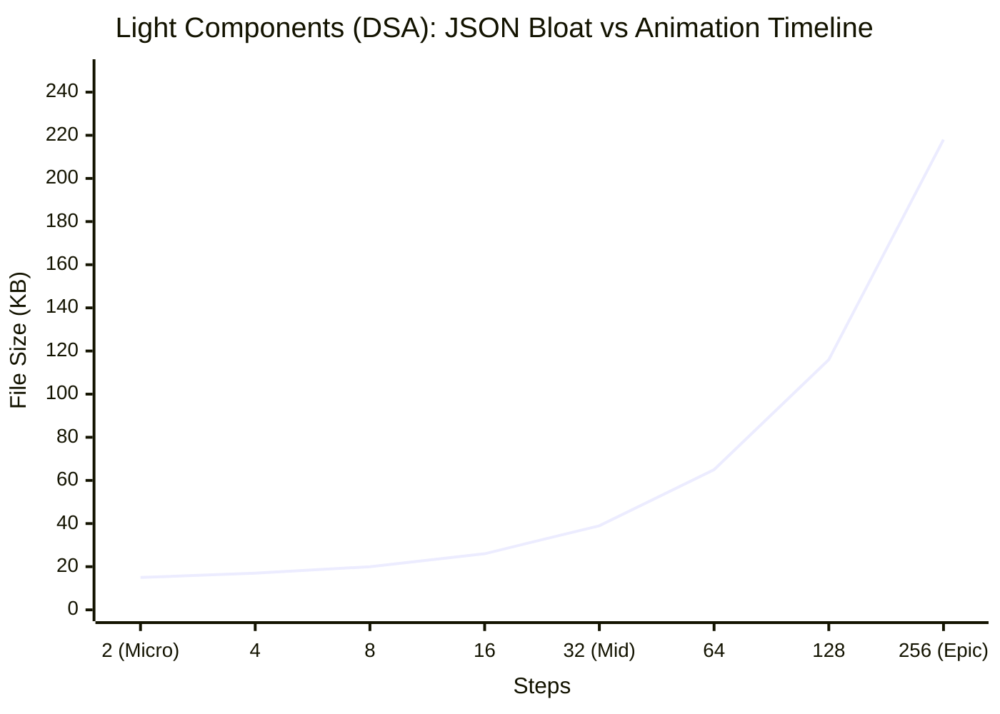
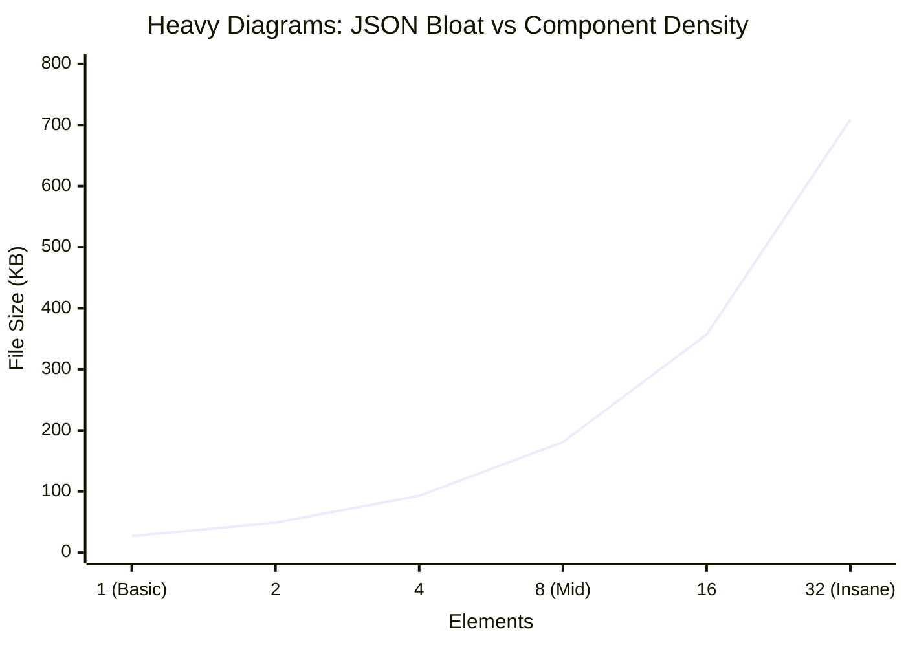
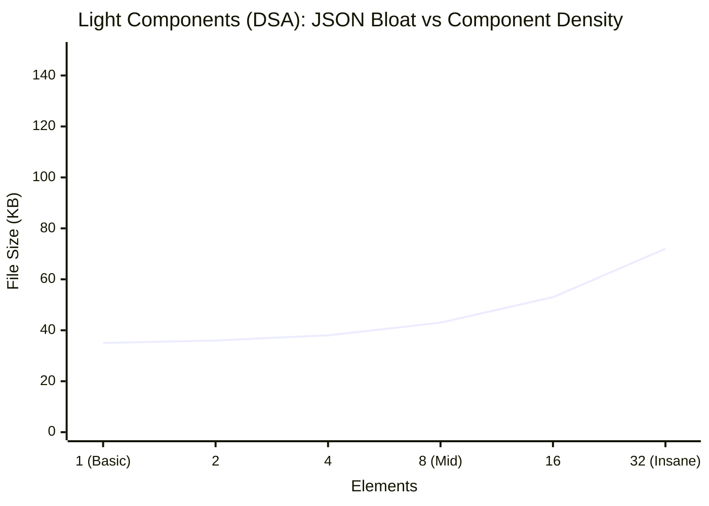

# Scene JSON Size Analysis (Pre-Optimization Baseline)

> [!WARNING]  
> **Before Optimization Baseline**  
> This document logs the raw JSON sizes directly from `src/content/scenes` prior to any minification, deduplication, or structural optimization (delta logic). This serves as the benchmark to measure exactly how scaling visual logic impacts payload sizes natively.

---

## ⚖️ 1. Identifying the Impact: "Light Components" vs "Heavy Diagrams"

To accurately estimate your JSON sizes, we must divide scenes into two distinct categories based on their schema payloads:

**A. Light Components (DSA arrays, badges, variables)**
*These make up the vast majority of your scenes.* When you update an array or a badge, the JSON action payload is tiny (e.g., passing a single value or color string). Because the JSON footprint per action is minimal, these scale gracefully.

**B. Heavy Diagrams (HLD Architecture Graphs, Deep Systems)**
*These are scenes like `copilot-agent-architecture.json`.* When you update a system diagram, the JSON payload forces you to re-declare **every single connected node and edge** inside every animation step. This causes a devastating *multiplicative* bloat ($Steps \times Visuals$) where file sizes explode exponentially.

---

## 📊 2. Core Summary & Overview

Based on the 26 existing scenes, the average scene configures **8.4 Steps** and **3.3 Visual Elements** and averages **~16.6 KB**.

### 📑 Raw Data Table (Ordered by Size)

| File Name | Size (KB) | Steps | Visuals | Total Actions | Approx. Text Size* (KB) |
| :--- | :--- | :--- | :--- | :--- | :--- |
| `test/minimal.json` | 4.4 | 3 | 1 | 2 | 0.7 |
| `dsa/two-sum.json` | 5.7 | 5 | 3 | 8 | 0.7 |
| `dsa/reverse-linked-list.json` | 6.8 | 6 | 2 | 9 | 0.7 |
| `dsa/climbing-stairs.json` | 8.9 | 8 | 2 | 11 | 0.5 |
| `dsa/binary-search.json` | 9.2 | 6 | 2 | 9 | 0.7 |
| `dsa/valid-parentheses.json` | 10.2 | 8 | 3 | 19 | 0.8 |
| `dsa/level-order-bfs.json` | 10.4 | 10 | 3 | 19 | 0.8 |
| `dsa/merge-sort.json` | 11.1 | 10 | 2 | 17 | 0.9 |
| `dsa/sliding-window-max.json` | 11.1 | 8 | 3 | 21 | 0.8 |
| `lld/min-stack.json` | 12.5 | 9 | 4 | 32 | 1.2 |
| `concepts/js-event-loop.json` | 13.1 | 12 | 5 | 29 | 2.1 |
| `dsa/number-of-islands.json` | 15.3 | 8 | 3 | 19 | 0.9 |
| `hld/consistent-hashing.json` | 15.7 | 5 | 3 | 11 | 1.2 |
| `dsa/fibonacci-recursive.json`| 15.9 | 10 | 2 | 17 | 0.6 |
| `lld/lru-cache.json` | 17.6 | 11 | 3 | 30 | 1.5 |
| `lld/design-hashmap.json` | 19.3 | 9 | 4 | 28 | 1.3 |
| `lld/trie.json` | 20.1 | 9 | 2 | 16 | 1.2 |
| `concepts/git-branching.json` | 20.6 | 12 | 2 | 24 | 2.1 |
| `concepts/hash-tables.json` | 21.0 | 10 | 5 | 36 | 2.3 |
| `hld/chat-system.json` | 21.1 | 6 | 3 | 12 | 1.2 |
| `lld/rate-limiter.json` | 21.7 | 10 | 5 | 30 | 1.7 |
| `hld/url-shortener.json` | 23.1 | 8 | 6 | 22 | 0.9 |
| `hld/twitter-feed.json` | 24.8 | 6 | 4 | 14 | 1.2 |
| `concepts/load-balancer.json` | 25.7 | 10 | 5 | 31 | 2.2 |
| `concepts/dns-resolution.json`| 26.8 | 10 | 3 | 29 | 1.9 |
| **`hld/copilot-agent-arc`** | **39.3** | **9** | **5** | **21** | **1.9** |

---

## 📈 3. Extreme Scale Visualizations (Logarithmic Models) 

These charts visualize exactly how file bloat acts aggressively under high load scenarios. The X-Axes are **log-scaled** to easily capture the size difference between a "Micro" setup and a huge "Epic/Insane" setup. 

To easily compare, we calculate the estimated JSON weight for both **Light Components** and **Heavy Diagrams** simultaneously.

### Chart A: Size vs Steps (Assuming Exactly 10 Visual Elements are active)
This tracks how a scene expands simply by advancing a longer animation timeline.

### Chart B: Size vs Visual Density (Assuming Exactly 40 Steps are active)
This tracks how a scene expands simply by dumping more interactive items into the DOM.

---

## 🧮 4. The Extrapolation Matrix (Heavy Architectures)

*What happens if you scale an unoptimized, massive network diagram scene to extreme numbers?*
Because the massive node payloads repeat every frame, an 80-step Masterclass scene featuring 20 diagrams approaches a gigabyte.

| Steps ↓ \ Heavy Diagrams → | 5 Heavy Diagrams | 10 Heavy Diagrams | 20 Heavy Diagrams |
| :---| :--- | :--- | :--- |
| **10 Steps** | ~40 KB | ~75 KB | ~145 KB |
| **20 Steps** | ~65 KB | ~125 KB | ~245 KB |
| **40 Steps** | ~115 KB | ~225 KB | ~445 KB |
| **80 Steps** | ~215 KB | ~425 KB | **~845 KB (Critical Bloat)** |

---

## 💡 Future Optimization Path

To keep your application snappy and ensure massive config files do not choke mobile bandwidth, standard optimizations must be applied to the JSON engine:
1. **Delta Actions:** Instead of re-stating an entire visual's structure inside `{params: ...}`, actions should only register the singular diff/node update.
2. **Definitional Hoisting:** Declare standard visual properties strictly at initialization and avoid duplicating them repetitively across actions.
