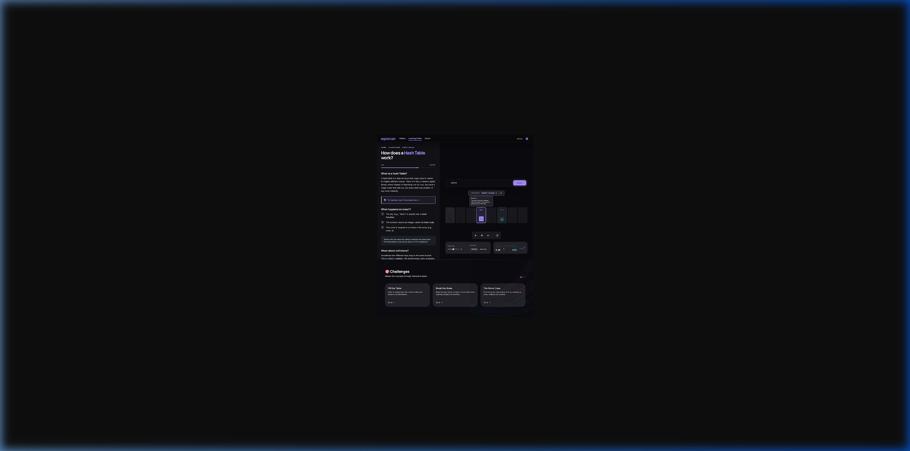
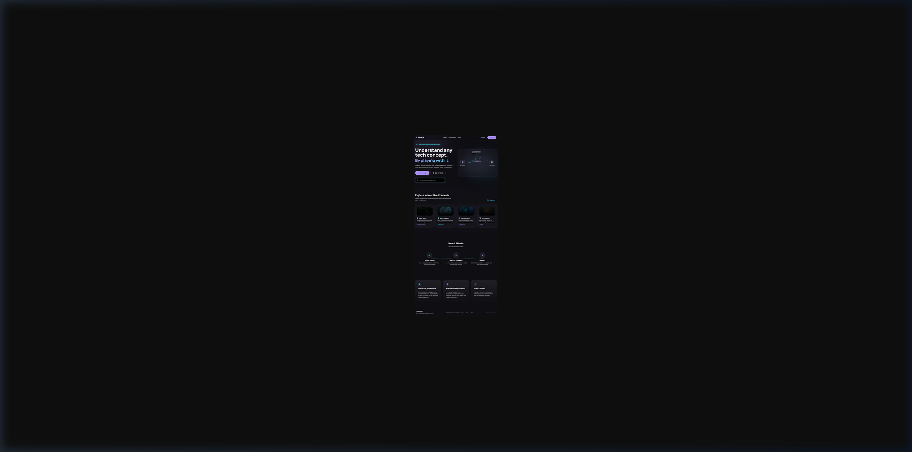

# 🔬 project_insyte

> **"See how it works."** — Paste any concept or any code → Get a living, interactive visual explanation you can play with and talk to.

---

## 📁 Folder Structure

```
project_insyte/
├── README.md              ← You are here
├── PROJECT_SPEC.md        ← Architecture, scene format, AI pipeline, competitive analysis
├── FEATURES.md            ← All 9 features, content library, gamification, retention loop
├── FEASIBILITY.md         ← 2.5-week plan, primitives, must-have vs nice-to-have, risks
├── AI_STRATEGY.md         ← Live tutor vision, hybrid caching, BYOK, cost math
├── DSA_VISUALIZER.md      ← Paste code → animated execution trace, visual primitives
├── NAMING.md              ← Final name: insyte ✅ (with rationale)
├── VISUALIZATION_ARCHITECTURE.md ← How DSA/LLD/HLD visualization actually works
├── CODEBASE_ARCHITECTURE.md ← Folder structure, tech stack, data flows, and build order
└── designs/
    ├── simulation_page.png  ← Hash Table simulation page (dark theme, popups)
    └── landing_page.png     ← Landing page
```

---

## 🏷️ The Name: **insyte**

- **Meaning**: "Insight" stylized — deep visual understanding into any tech concept
- **Tagline**: "See how it works."
- **URL**: `insyte.dev`
- **Vibe**: Premium, clean, works for both concept explorer and DSA visualizer modes

---

## 💡 The Product (Two Modes)

### Mode 1: Concept Explorer
Type: **"How does a hash table work?"**
Get: A live, interactive visual simulation with explanations, popups, and controls.

### Mode 2: DSA Visualizer
Paste: **LeetCode problem + solution code**
Get: A step-by-step animated code execution trace — like a beautiful PythonTutor with AI explanations.

**Both modes use the same engine, same primitives, same AI live chat.**

---

## 📚 All Docs

| Document | Contents |
|----------|---------|
| [PROJECT_SPEC.md](PROJECT_SPEC.md) | Full architecture, scene JSON format, AI pipeline, competitive analysis |
| [FEATURES.md](FEATURES.md) | 9 features: side-by-side, complexity graph, zoom-in, code view, challenges, depth slider, knowledge map, embed, paths |
| [FEASIBILITY.md](FEASIBILITY.md) | 2.5-week plan, 12 reusable primitives, must-have vs nice-to-have, risks |
| [AI_STRATEGY.md](AI_STRATEGY.md) | 3-layer hybrid caching, live tutor diffs, Gemini free tier, BYOK, Milestone 1 plan |
| [DSA_VISUALIZER.md](DSA_VISUALIZER.md) | Paste code feature, 12 visual templates for DSA, comparison with PythonTutor, milestone scope |
| [NAMING.md](NAMING.md) | Final name decision: **insyte** ✅ |
| [VISUALIZATION_ARCHITECTURE.md](VISUALIZATION_ARCHITECTURE.md) | Sandbox+AI pipeline for DSA, LLD sub-categories, HLD interactive diagrams, honest limitations |
| [CODEBASE_ARCHITECTURE.md](CODEBASE_ARCHITECTURE.md) | Full folder structure, tech stack, 4 core data flows, Scene JSON schema, and build order |

---

## 🎨 Designs (directional — actual canvas will differ)

| Screen | Preview |
|--------|---------|
| Simulation Page |  |
| Landing Page |  |

Design inspiration: langflow.org (glowing bezier connectors), n8n.io (dark node canvas), Linear/Vercel aesthetic

---

## 🔑 Key Decisions Made

| Decision | Choice | Rationale |
|----------|--------|-----------|
| Name | **insyte** | Premium, short, works for both modes |
| AI in Milestone 1 | We pay (Gemini free tier) + BYOK option | Maximum user acquisition, near-zero cost |
| Caching | Hybrid: cached base + live AI diffs on top | 80% served free, 20% needs live AI |
| DSA solving | User provides code (Mode 1 only) | AI solving is unreliable for Hard problems |
| Languages | Python + JavaScript first | Covers 90% of LeetCode users |
| VS Code extension | ❌ No | Kills the "click link → start learning" magic |

---

## Stitch Project ID
`9371664881906732772` *(directional designs only, not to be followed as-is)*

---

*Created: April 3, 2026 · Renamed: April 4, 2026 · Status: Planning → Ready to Build*
