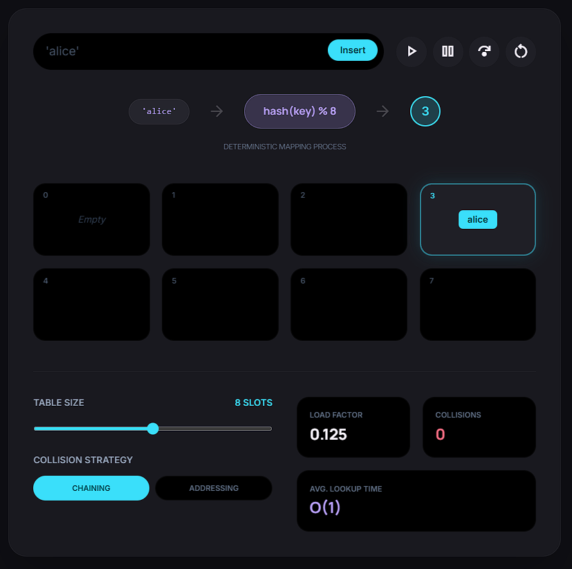

# Manual Regression Bugs and Improvements

- [ ] The table design is not so good very round , everything is too round not good.
- [ ] Many warnings on console to use color code instead.
- [ ] Everything should have a lable in the visualization currently its all so much info and not able to understand type info.
- [ ] Too much of shadows we should consider going clean on the animations so its not hard to read them like in stitch design for canvas - keep it simple most of the times just have shadows when required not for everything - .
- [ ] All objects are very scattered not at correct positions to look professional.
- [ ] We should tell users about what these colors are indicating etc.
- [ ] Website is a little slow ? Need optimizations for these objects and react nodes ? Why didn't we use canvas for this purpose for visualization why did we go with react nodes ?
- [ ] Does canvas bottom controls even work ?
- [ ] Are animations too fast to follow ? And there isn't an indicator to show that step will move forward, like a visual que.
- [ ] Animations overflowing the canvas , canvas becomes vertically scrollable which is not ideal for many not complicated things, we should try to manage the elements more better on the canvas.
- [ ] Colors are off may be due to all those warnings.
- [ ] `/s/js-event-loop` doesn't have very readable animations not at all good.
- [ ] Noticed in dns-resolution not enough gaps between servers.
- [ ] how about draggable nodes to manual arrange or overkill ?
- [ ] in git-branching example : position of the git branches is a issue not centered either and the text just overflows we should come up with better way to display log text where needed.
- [ ] If commands are involved we should show them at a fixed position to keep it readable and not interfere with the visualization may be ?
- [ ] The git example could have done better job of utilizing different nodes to represent branch vs commit vs names etc
- [ ] Visualizations should have same postion and new nodes should be added so transition is smooth in step changes and very followable and understandable too.
- [ ] Canvas elements should have hover effects to show descriptions etc.
- [ ] Right click on canvas ?
- [ ] StackViz is very unreadable.
- [ ] How about a code visualization side by side - as js-event-loop very imcomplete without it.
