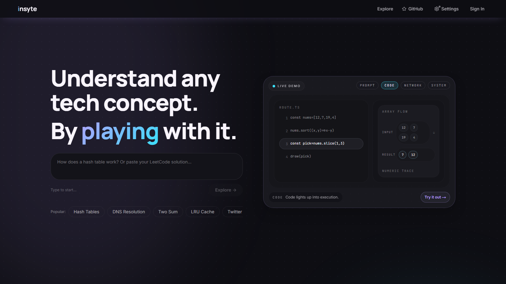
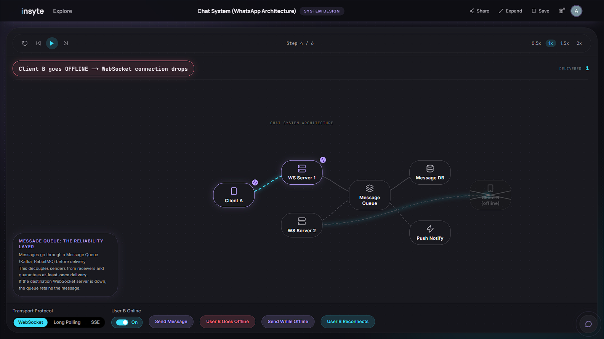
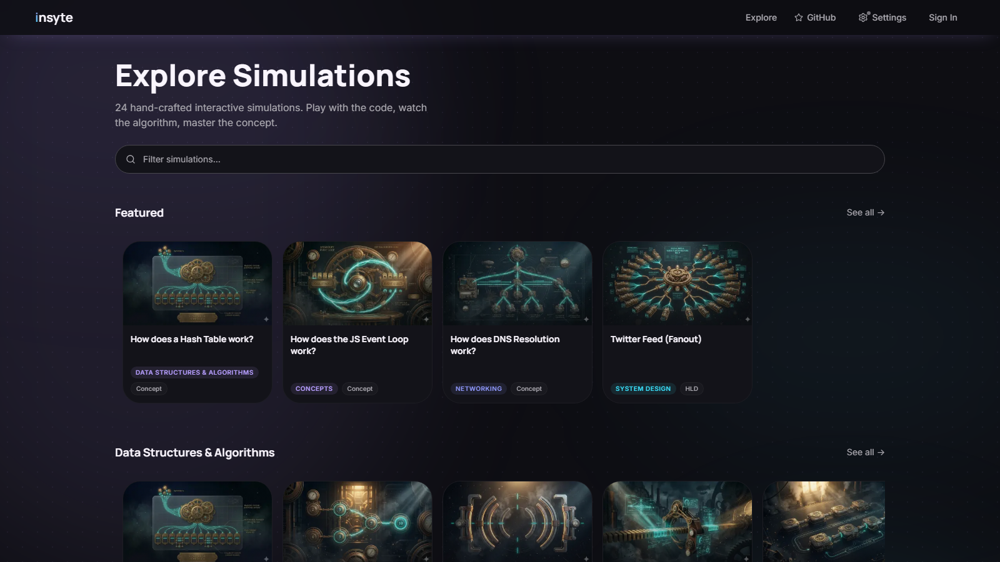
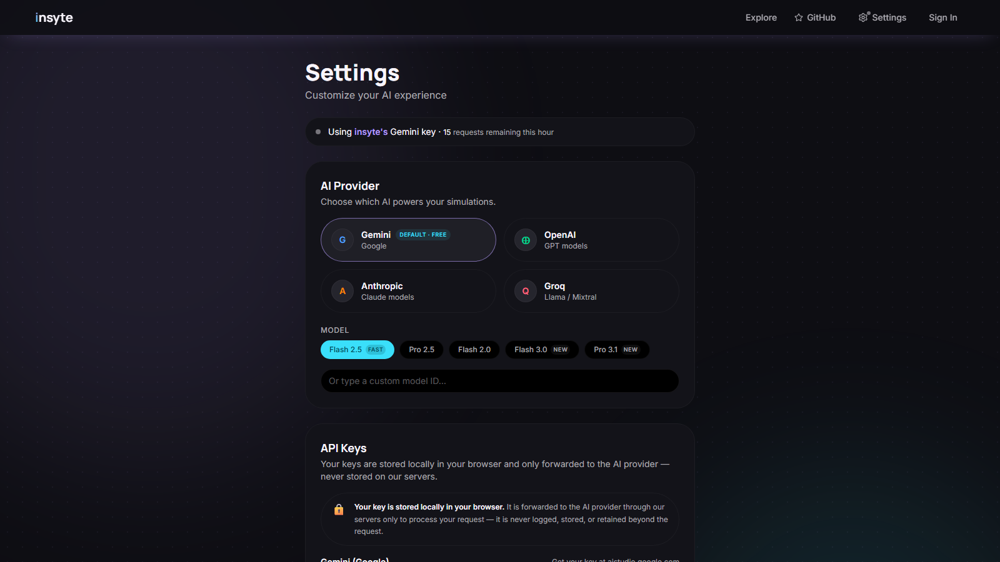

<p align="center">
  <picture>
    <source media="(prefers-color-scheme: dark)" srcset="docs/assets/insyte-wordmark-dark.svg">
    
  </picture>
</p>

<p align="center">
  <strong>AI-powered interactive simulations for concepts, DSA traces, and system design.</strong><br/>
  Turn prompts into live visuals you can scrub, replay, tweak, and discuss.
</p>

<p align="center">
  <a href="#quick-start"></a>
  <a href="docs/README.md"></a>
  <a href="docs/architecture/tech-architecture.md"></a>
</p>

<p align="center">
  <a href="https://nextjs.org/"></a>
  <a href="https://www.typescriptlang.org/"></a>
  <a href="https://supabase.com/"></a>
  <a href="https://sdk.vercel.ai/"></a>
  <a href="https://vercel.com/"></a>
</p>

## Why insyte

- **Prompt-first workflow** for concept explanations, DSA algorithm traces, and system design walkthroughs.
- **6-stage AI pipeline** — free reasoning → scene skeleton → steps + states → popups + misc (parallel) → deterministic assembly. Per-stage retry budget, partial-success recovery, no monolithic JSON hallucination.
- **Scene Spec v2** — a strict JSON data contract separating AI-generated fields from deterministic derivations. No XY coordinates; the layout engine (dagre / d3-hierarchy / arithmetic) positions everything from structural hints alone.
- **Topology-state split** — graph, tree, and system-diagram types carry sparse `nodeStates`/`edgeStates` overlays per step; sequential types carry full snapshots. Cuts average scene payload by ~60% with no change to the player API.
- **Scene-based runtime** — step engine, pluggable layout engine, scene-graph diff, LRU cache, and targeted Framer Motion animations — all in `packages/scene-engine`.
- **BYOK** for Gemini, OpenAI, Anthropic, Groq, Ollama (local), and any OpenAI-compatible endpoint. Keys live in browser `localStorage` only — never reach server logs.
- **Three scene paths, one unified player** — static pre-built JSON, Supabase-cached AI output, and live AI-streamed generation.

## Quick Navigation

| Section | Link |
| --- | --- |
| Live product screens | [Product Preview](#product-preview) |
| Local setup | [Quick Start](#quick-start) |
| Environment variables | [Environment Setup](#environment-setup) |
| Scripts | [Commands](#commands) |
| Docs hub | [Documentation](#documentation) |
| Monorepo layout | [Architecture](#architecture) |
| Deployment | [Deployment Notes](#deployment-notes) |
| Contribution flow | [Contributing](#contributing) |

## Quick Start

### Prerequisites

- Node.js 20+
- pnpm 10+

### Run locally

```bash
pnpm install
cp apps/web/.env.example apps/web/.env.local
pnpm dev
```

Open `http://localhost:3000`.

On Windows (PowerShell), you can copy env file with:

```powershell
Copy-Item apps/web/.env.example apps/web/.env.local
```

## Environment Setup

`apps/web/.env.example` documents required production variables.

| Variable | Purpose |
| --- | --- |
| `NEXT_PUBLIC_APP_URL` | Public origin for canonical URLs and OG metadata |
| `NEXT_PUBLIC_SUPABASE_URL` | Supabase project URL |
| `NEXT_PUBLIC_SUPABASE_ANON_KEY` | Browser-safe key for auth/client reads |
| `SUPABASE_SERVICE_ROLE_KEY` | Server-side key for caching, seeding, and rate-limits |
| `GEMINI_API_KEY` | Server fallback key for non-BYOK generation |

`apps/web/.env.local` is gitignored at both repo root and app level.

## Commands

| Command | Description |
| --- | --- |
| `pnpm dev` | Start full Turborepo dev pipeline (packages watch + web dev server) |
| `pnpm build` | Build all packages then the app |
| `pnpm type-check` | TypeScript check across the entire workspace |
| `pnpm test` | Run Vitest unit tests (step engine, validators, assembly, scene-graph) |
| `pnpm validate-scenes` | Validate all 26 production scene JSON files against `SceneSchema` |
| `pnpm --filter web seed` | Seed topic index metadata to Supabase |
| `pnpm --filter web seed-scenes` | Seed scene records to Supabase |

## Product Preview

<p align="center">
  <sub>Live product snapshots from <a href="https://insyte.amanarya.com/">insyte.amanarya.com</a></sub>
</p>

<p align="center">
  <a href="docs/assets/screenshots/home.png">
    
  </a>
</p>

<p align="center">
  <sub><strong>Homepage</strong> | Prompt-first landing and live demo entry</sub>
</p>

<table align="center" width="92%" cellpadding="8" cellspacing="0">
  <tr>
    <td align="center" valign="top" width="33%">
      <a href="docs/assets/screenshots/simulation-chat-system.png">
        
      </a>
      <p><strong>Simulation Player</strong><br/><sub>Interactive playback and controls</sub></p>
    </td>
    <td align="center" valign="top" width="33%">
      <a href="docs/assets/screenshots/explore.png">
        
      </a>
      <p><strong>Explore</strong><br/><sub>Curated simulation catalog</sub></p>
    </td>
    <td align="center" valign="top" width="33%">
      <a href="docs/assets/screenshots/settings.png">
        
      </a>
      <p><strong>Settings</strong><br/><sub>Provider and BYOK controls</sub></p>
    </td>
  </tr>
</table>

## Architecture

### Packages

- `apps/web` — Next.js 16 app: App Router pages, API routes, 6-stage AI pipeline, simulation player, Supabase integration, Pyodide WASM sandbox.
- `packages/scene-engine` — pure TypeScript runtime library: Scene Spec v2, Zod schema, step engine, layout engine (dagre / d3-hierarchy / arithmetic), scene-graph diff, LRU cache.
- `packages/tsconfig` — shared TypeScript base configs.
- `.planning/` — product roadmap (`PROJECT.md`), design system (`DESIGN.md`), per-phase plans.

### Scene rendering flow

```
Prompt → /api/generate (SSE stream)
           └─ AI Pipeline (Stages 0–5)
                └─ Scene JSON v2 [Zod validated]
                     └─ Zustand scene-slice
                          └─ useSceneRuntime
                               ├─ computeLayout()      → dagre / d3-hierarchy / arithmetic
                               ├─ computeSceneGraph()  → nodes, edges, groups per step
                               └─ LRU cache (memoized across step seeks)
                                    └─ CanvasContext → Primitive renderers → Framer Motion
```

## Documentation

Full docs index: **[docs/README.md](docs/README.md)**

| Doc | What it covers |
| --- | --- |
| [Platform Architecture](docs/architecture/tech-architecture.md) | Full system Mermaid diagram — browser, server, AI module, scene-engine, Supabase |
| [AI Pipeline](docs/architecture/ai-pipeline.md) | Stage map, GenerationEvent protocol, schema flow, live chat |
| [How the AI Module Works](docs/explained/ai-module.md) | Plain-English walkthrough of all 6 stages |
| [Scene Engine Reference](docs/scene-engine/scene-engine.md) | Scene JSON v2 contract, enums, step engine API, layout hints, scene-graph |
| [API Reference](docs/backend/api-reference.md) | All server endpoints — request/response shapes and status codes |
| [Supabase Data Model](docs/backend/data-model.md) | Tables, privacy rules, runtime query patterns |
| [Adding Scenes & Primitives](docs/guides/adding-scenes-and-primitives.md) | Step-by-step checklists for new scenes, visual types, controls, and providers |
| [Gemini Server Key Cost Analysis](.planning/analysis/GEMINI_COST_ANALYSIS.md) | Per-scene cost breakdown for all 5 scene types in server key mode — USD + INR, stage-by-stage token estimates, at-scale projections |

## BYOK

insyte supports Bring Your Own Key for all providers from the Settings page:

| Provider | Type | Notes |
| --- | --- | --- |
| Gemini | Cloud | Server default (free tier). Requires `GEMINI_API_KEY` env var for fallback. |
| OpenAI | Cloud | BYOK only. Key stored client-side. |
| Anthropic | Cloud | BYOK only. Key stored client-side. |
| Groq | Cloud | BYOK only. Key stored client-side. |
| Ollama | Local | No key required. Set base URL to your Ollama instance. Requires `OLLAMA_ORIGINS=https://insyte.amanarya.com` when starting Ollama. |
| Custom | Any OpenAI-compatible | Provide base URL + optional key. Covers LM Studio, vLLM, Together.ai, etc. |

> **Server key cost (Gemini, free tier):** generating a scene via insyte's `GEMINI_API_KEY` costs approximately **$0.07–$0.15 per scene (₹6.93–₹14.43)** depending on scene type and topic complexity, billed to the server Gemini key. See [Gemini Server Key Cost Analysis](.planning/analysis/GEMINI_COST_ANALYSIS.md) for a full per-stage breakdown, at-scale projections, and INR equivalents as of May 2026.

- Keys are stored in browser `localStorage` only — never sent to or logged by the insyte server.
- Keys are forwarded per request in request headers (`x-api-key`, `x-provider`, `x-model`, `x-base-url`).
- Cloud provider calls always run server-side for key protection. Ollama runs browser-direct (Vercel bypassed).

## Deployment Notes

- Vercel monorepo root directory: `.`
- Build command: `turbo build --filter=web`
- Install command: `pnpm install --frozen-lockfile`
- Enable Vercel Analytics in project settings after deployment.
- Run `pnpm validate-scenes` before deploy.

Pyodide is served from `/pyodide/*` with route-scoped COOP/COEP headers. Production CSP keeps `'unsafe-eval'` because Pyodide's WASM toolchain requires it.

## Contributing

1. Create a branch.
2. Implement your change with tests/validation where possible.
3. Run `pnpm type-check`, `pnpm build`, and `pnpm validate-scenes`.
4. Open a PR with impact summary and verification notes.

## License

Licensed under [GPL-3.0](LICENSE).
