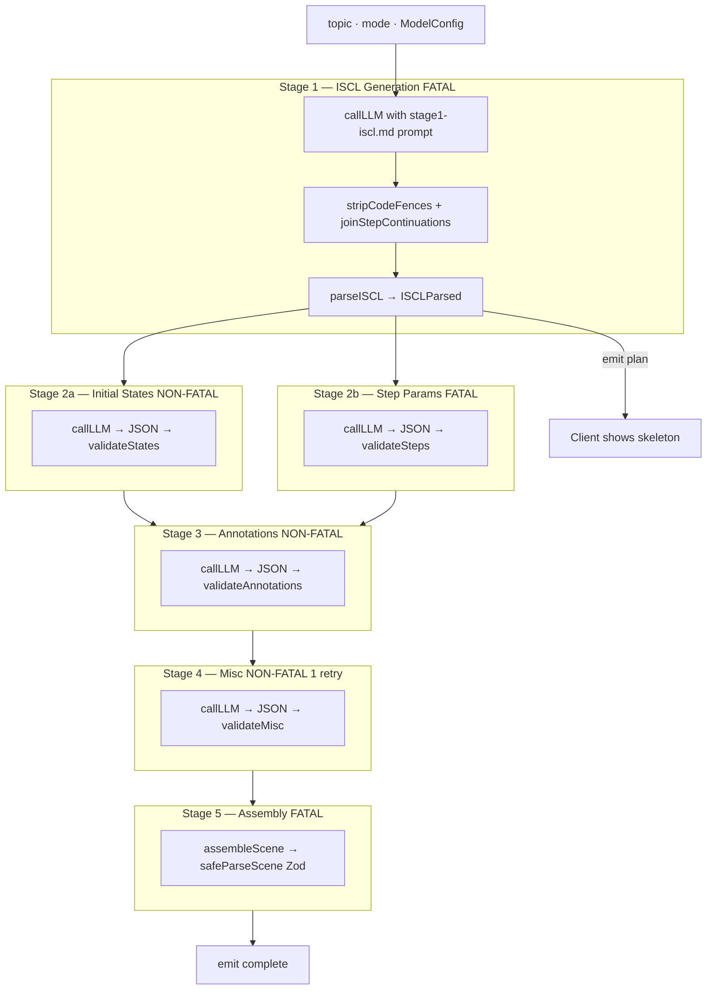

# AI Pipeline

The AI module (`apps/web/src/ai/`) runs a 5-stage async generator that converts a user topic into a validated `Scene` JSON object.

---

## GenerationEvent Protocol

The pipeline emits these events over SSE. Clients (`useStreamScene`) consume them in order:

| Event | Payload | When |
| --- | --- | --- |
| `plan` | `title, visualCount, stepCount, layout` | After Stage 1 — client shows skeleton |
| `content` | `states, steps` | After Stages 2a + 2b |
| `annotations` | `explanation, popups` | After Stage 3 |
| `misc` | `challenges, controls` | After Stage 4 |
| `complete` | `scene: Scene` | After Stage 5 assembly passes Zod |
| `error` | `stage, message, retryable` | On any fatal stage failure |

---

## Stage Map



**Fatal** = pipeline aborts on failure. **Non-fatal** = falls back to empty value, pipeline continues.

Stages 2a + 2b run in parallel (`Promise.all`). Default retry budget: 2 per stage (`PIPELINE_MAX_RETRIES` env var).

---

## ISCL Pre-Processors

Two fixes applied to raw LLM output before parsing (`iscl-preprocess.ts`):

| Fix | Problem | Solution |
| --- | --- | --- |
| `stripCodeFences` | Model wraps ISCL in ` ```iscl ``` ` | Strip leading/trailing fences |
| `joinStepContinuations` | Model splits `STEP` body across multiple lines | Rejoin bare `SET …` lines to previous STEP |

---

## Live Chat

`/api/chat` is separate from generation. `buildSceneContext(scene, currentStep)` extracts a minimal context block (title, type, current explanation, visual summary) to avoid dumping the full scene JSON. Uses `streamText` for progressive token delivery.

---

## Environment

| Variable | Default | Effect |
| --- | --- | --- |
| `PIPELINE_MAX_RETRIES` | `2` | Per-stage retry budget. `0` = fail fast for debugging. |
