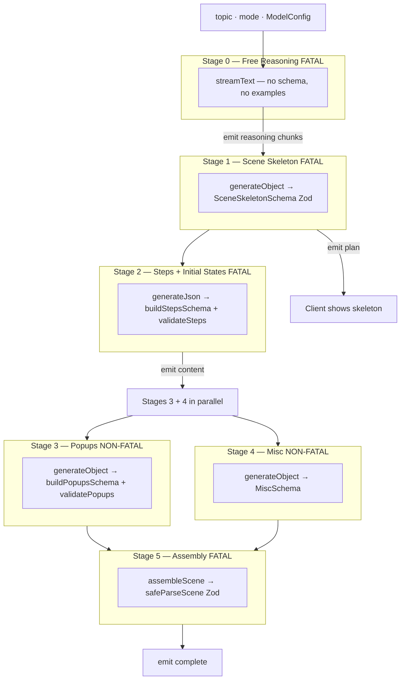

# AI Pipeline

The AI module (`apps/web/src/ai/`) runs a 6-stage async generator that converts a user topic into a validated `Scene` JSON v2 object.

---

## GenerationEvent Protocol

The pipeline emits these events over SSE. Clients (`useStreamScene`) consume them in order:

| Event | Payload | When |
| --- | --- | --- |
| `reasoning` | streamed text chunks | During Stage 0 — free reasoning |
| `plan` | `SceneSkeletonParsed` | After Stage 1 — client shows skeleton |
| `content` | `StepsParsed` | After Stage 2 — steps + initial states |
| `annotations` | `PopupsParsed` | After Stage 3 (non-fatal) |
| `misc` | `MiscParsed` | After Stage 4 (non-fatal) |
| `complete` | `scene: Scene` | After Stage 5 assembly passes `safeParseScene()` |
| `error` | `stage, message, retryable` | On any fatal stage failure |

---

## Stage Map

```mermaid
flowchart TD
    INPUT[topic · mode · ModelConfig] --> S0

    subgraph S0_BOX["Stage 0 — Free Reasoning  FATAL"]
        S0[streamText — no schema, no examples]
    end

    S0 -->|emit reasoning chunks| S1_BOX

    subgraph S1_BOX["Stage 1 — Scene Skeleton  FATAL"]
        S1[generateObject → SceneSkeletonSchema Zod]
    end

    S1_BOX -->|emit plan| CLIENT_PLAN[Client shows skeleton]

    S1_BOX --> S2_BOX

    subgraph S2_BOX["Stage 2 — Steps + Initial States  FATAL"]
        S2[generateJson → buildStepsSchema + validateSteps]
    end

    S2_BOX -->|emit content| S34

    S34["Stages 3 + 4 in parallel"]

    subgraph S3_BOX["Stage 3 — Popups  NON-FATAL"]
        S3[generateObject → buildPopupsSchema + validatePopups]
    end

    subgraph S4_BOX["Stage 4 — Misc  NON-FATAL"]
        S4[generateObject → MiscSchema]
    end

    S34 --> S3_BOX & S4_BOX

    S3_BOX & S4_BOX --> S5_BOX

    subgraph S5_BOX["Stage 5 — Assembly  FATAL"]
        S5[assembleScene → safeParseScene Zod]
    end

    S5_BOX --> COMPLETE[emit complete]
```

**Fatal** = pipeline aborts on failure. **Non-fatal** = falls back to empty value, pipeline continues.

Stage 2 is the heaviest stage — it co-generates steps AND initial canvas states. Default retry budget: 2 per stage (`PIPELINE_MAX_RETRIES` env var).

---

## Schema Flow

| Stage | Schema used | Anti-hallucination |
| --- | --- | --- |
| 1 (skeleton) | `SceneSkeletonSchema` | canvas IDs constrained to regex |
| 2 (steps) | `buildStepsSchema()` + `validateSteps()` | canvas/hud keys checked against skeleton IDs |
| 3 (popups) | `buildPopupsSchema(canvasIds)` | `attachTo` enum-constrained to canvas IDs |
| 4 (misc) | `MiscSchema` | static schema |
| 5 (assembly) | `safeParseScene()` = `buildSceneSchema()` + `.superRefine()` | cross-field: popup.attachTo + step.canvas keys vs canvas[] |

---

## Live Chat

`/api/chat` is separate from generation. `buildChatContextBlock(ctx)` extracts a minimal context block (title, type, current explanation, visual summary). Patches use Scene v2 step format (`canvas`, `activeText`, `hud` — not v1 `actions[]`). Uses `streamText` for progressive token delivery.

---

## Environment

| Variable | Default | Effect |
| --- | --- | --- |
| `PIPELINE_MAX_RETRIES` | `2` | Per-stage retry budget. `0` = fail fast for debugging. |
