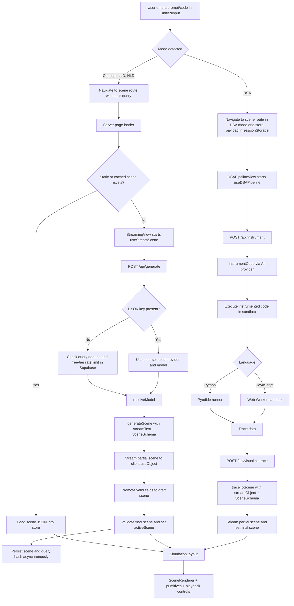

# Prompt to Visualization Flow

This diagram captures how input becomes an interactive scene, including both concept/system-design mode and DSA trace mode.

```mermaid
flowchart TD
    A[User enters prompt/code in UnifiedInput] --> B{Mode detected}

    B -->|Concept, LLD, HLD| C[Navigate to scene route with topic query]
    B -->|DSA| D[Navigate to scene route in DSA mode and store payload in sessionStorage]

    C --> E[Server page loader]
    E --> F{Static or cached scene exists?}
    F -->|Yes| G[Load scene JSON into store]
    F -->|No| H[StreamingView starts useStreamScene]

    H --> I[POST /api/generate]
    I --> J{BYOK key present?}
    J -->|No| K[Check query dedupe and free-tier rate limit in Supabase]
    J -->|Yes| L[Use user-selected provider and model]
    K --> M[resolveModel]
    L --> M
    M --> N[generateScene with streamText + SceneSchema]
    N --> O[Stream partial scene to client useObject]
    O --> P[Promote valid fields to draft scene]
    P --> Q[Validate final scene and set activeScene]
    Q --> R[Persist scene and query hash asynchronously]

    D --> S[DSAPipelineView starts useDSAPipeline]
    S --> T[POST /api/instrument]
    T --> U[instrumentCode via AI provider]
    U --> V[Execute instrumented code in sandbox]
    V --> W{Language}
    W -->|Python| X[Pyodide runner]
    W -->|JavaScript| Y[Web Worker sandbox]
    X --> Z[Trace data]
    Y --> Z
    Z --> AA[POST /api/visualize-trace]
    AA --> AB[traceToScene with streamObject + SceneSchema]
    AB --> AC[Stream partial scene and set final scene]

    G --> AD[SimulationLayout]
    Q --> AD
    AC --> AD
    AD --> AE[SceneRenderer + primitives + playback controls]
```
