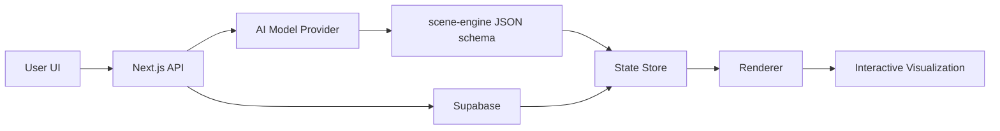
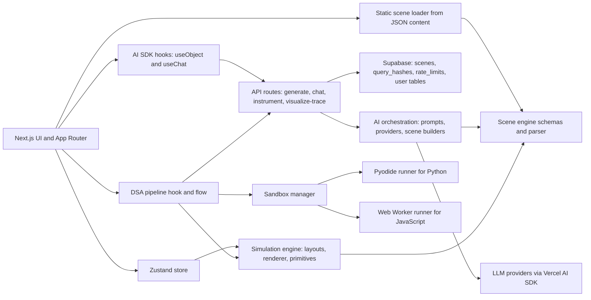
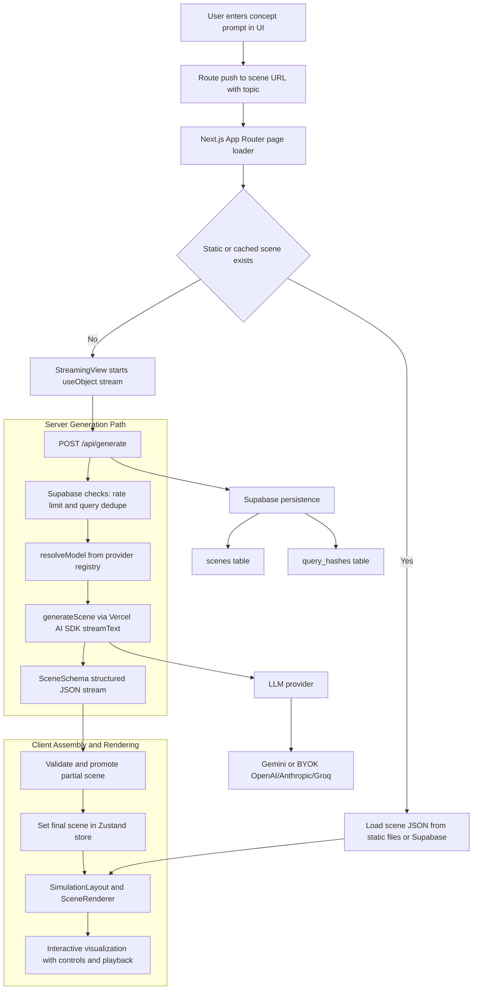
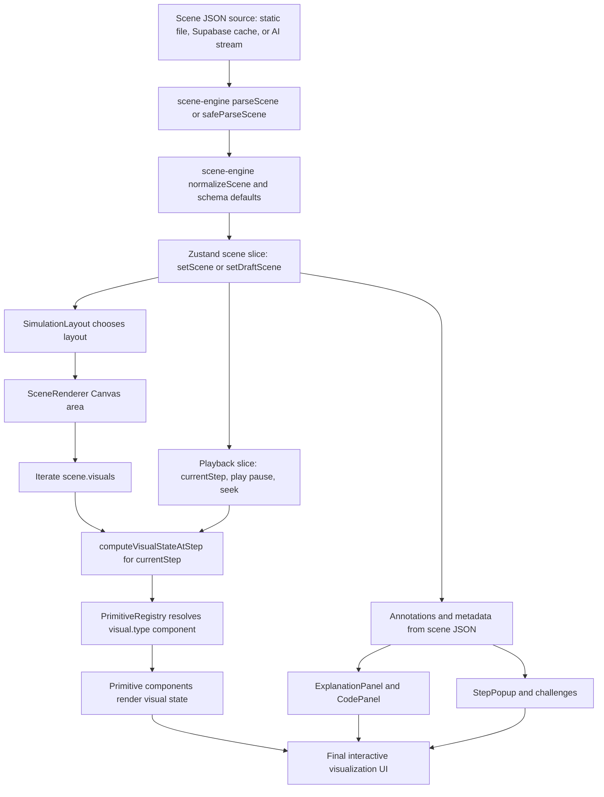

# Technical Architecture

This file contains four dedicated views:

## High-Level Tech Architecture (Very Simple)

1. High-level tech architecture (very simple)
2. Full platform technical architecture
3. Concept prompt to visualization technical architecture
4. Scene JSON to UI visualization rendering architecture

## Full Platform Technical Architecture (Dedicated)

## Concept Prompt to Visualization (Dedicated)

## Scene JSON to UI Visualization (Dedicated)

