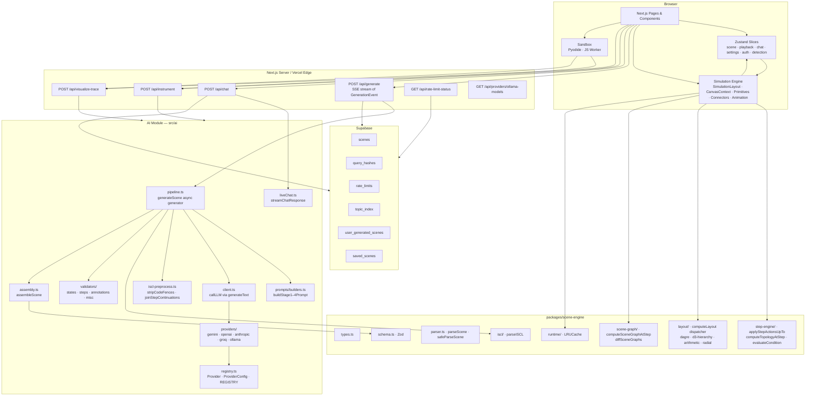

# Architecture

Platform architecture for `insyte`. Reference this to understand how the pieces connect.

```mermaid
flowchart TB
    subgraph BROWSER[Browser]
        UI[Next.js Pages & Components]
        STORE[Zustand Slices\nscene · playback · chat · settings · auth · detection]
        ENGINE[Simulation Engine\nSimulationLayout · CanvasContext · Primitives · Connectors · Animation]
        SANDBOX[Sandbox\nPyodide · JS Worker]
    end

    subgraph SERVER[Next.js Server / Vercel Edge]
        GEN[POST /api/generate\nSSE stream of GenerationEvent]
        CHAT[POST /api/chat]
        INST[POST /api/instrument]
        TRACE[POST /api/visualize-trace]
        RLAPI[GET /api/rate-limit-status]
        OLLAMA_PROXY[GET /api/providers/ollama-models]
    end

    subgraph AI_MOD[AI Module — src/ai]
        PIPELINE[pipeline.ts\ngenerateScene async generator]
        REGISTRY[registry.ts\nProvider · ProviderConfig · REGISTRY]
        PROVIDERS[providers/\ngemini · openai · anthropic · groq · ollama]
        BUILDERS[prompts/builders.ts\nbuildStage1–4Prompt]
        PREPROC[iscl-preprocess.ts\nstripCodeFences · joinStepContinuations]
        VALIDATORS[validators/\nstates · steps · annotations · misc]
        ASSEMBLY[assembly.ts\nassembleScene]
        LIVECHAT[liveChat.ts\nstreamChatResponse]
        CLIENT[client.ts\ncallLLM via generateText]
    end

    subgraph PKG[packages/scene-engine]
        TYPES[types.ts]
        SCHEMA[schema.ts · Zod]
        PARSER[parser.ts · parseScene · safeParseScene]
        ISCL_PKG[iscl/ · parseISCL]
        STEP[step-engine/ · applyStepActionsUpTo\ncomputeTopologyAtStep · evaluateCondition]
        LAYOUT_PKG[layout/ · computeLayout dispatcher\ndagre · d3-hierarchy · arithmetic · radial]
        SCENEGRAPH[scene-graph/ · computeSceneGraphAtStep\ndiffSceneGraphs]
        CACHE_PKG[runtime/ · LRUCache]
    end

    subgraph SUPABASE[Supabase]
        SCENES_TBL[scenes]
        QHASH[query_hashes]
        RLIMIT[rate_limits]
        TOPIDX[topic_index]
        UGSCENES[user_generated_scenes]
        SAVED[saved_scenes]
    end

    UI --> STORE
    UI --> ENGINE
    ENGINE --> STORE

    UI --> GEN
    UI --> CHAT
    UI --> INST
    UI --> TRACE

    GEN --> PIPELINE
    PIPELINE --> BUILDERS
    PIPELINE --> CLIENT
    PIPELINE --> PREPROC
    PIPELINE --> ISCL_PKG
    PIPELINE --> VALIDATORS
    PIPELINE --> ASSEMBLY
    CLIENT --> PROVIDERS
    PROVIDERS --> REGISTRY

    ASSEMBLY --> SCHEMA
    STORE --> ENGINE
    ENGINE --> STEP
    ENGINE --> LAYOUT_PKG
    ENGINE --> SCENEGRAPH
    ENGINE --> CACHE_PKG

    CHAT --> LIVECHAT
    INST --> AI_MOD
    TRACE --> AI_MOD

    GEN --> SUPABASE
    CHAT --> SUPABASE
    RLAPI --> SUPABASE

    UI --> SANDBOX
    SANDBOX --> INST
    SANDBOX --> TRACE
```
